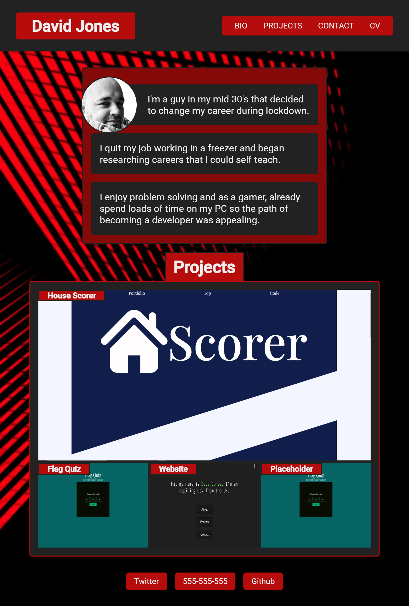
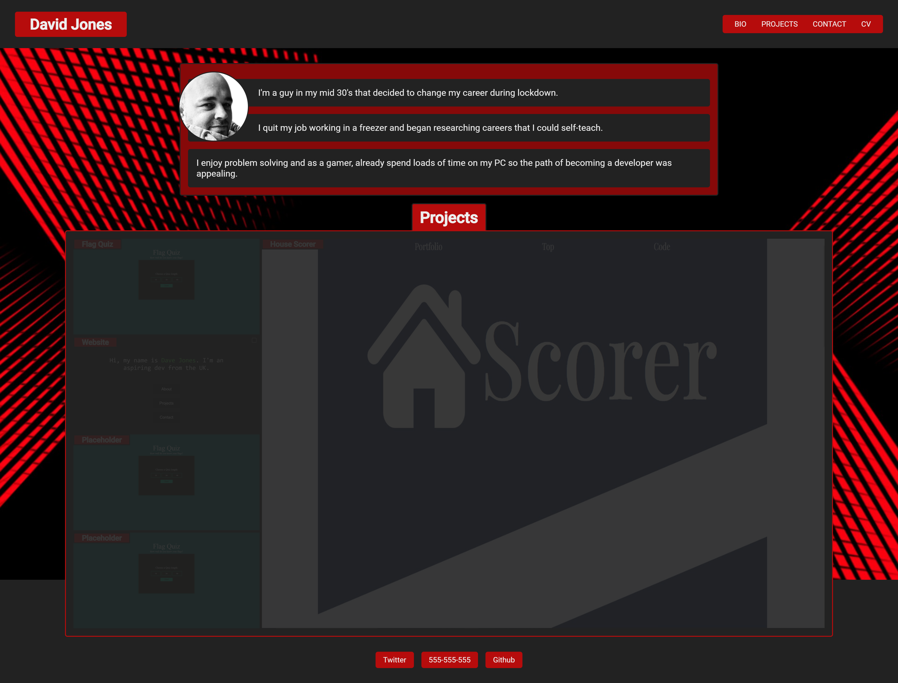

# Responsive portfolio

## My task is to create a responsive page showcasing what I have learned so far

A Front-End Developer portfolio serves to showcase your skills, past projects, and experience with front-end development. Potential clients and employers may rely on this information when deciding whether or not you're right for the job.

## Site & Repo
* [Site](https://dj-86.github.io/my-portfolio/)
* [Repo](https://github.com/DJ-86/my-portfolio)

## Resources:
* [Grid](https://developer.mozilla.org/en-US/docs/Learn/CSS/CSS_layout/Grids)
* [Flex](https://developer.mozilla.org/en-US/docs/Learn/CSS/CSS_layout/Flexbox)
* [Media queries](https://developer.mozilla.org/en-US/docs/Web/CSS/Media_Queries)

## Screenshots
### Site Mobile

### Site Tablet
 

## Site Desktop
 

## License
* [MIT](LICENSE.md)
